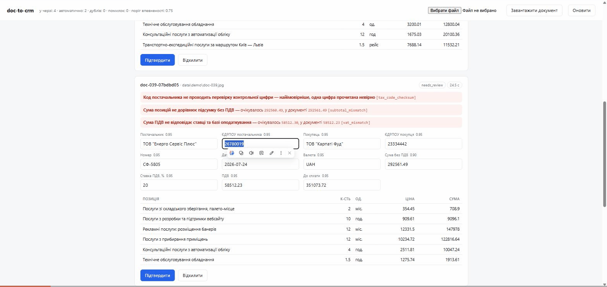

# doc-to-crm

Обробник первинних документів: PDF або фото рахунку на вході — структурований
запис в обліку на виході. Сумнівні документи не проходять мовчки, а стають у
чергу на ручну перевірку **з поясненням, що саме не зійшлося**.

Головна теза проекту в одному реченні:

> **Модель галюцинує суми — тому суми перевіряє Python, а не модель.**

Мовна модель бачить «12 400,00» і «12 480,00» як два схожі рядки. Різниця у
вісімдесят гривень для неї не є арифметичною помилкою — вона взагалі не рахує.
Тому все, що можна перерахувати або перевірити контрольною цифрою, перераховує
код: суми позицій, ПДВ, підсумок, контрольна цифра ЄДРПОУ, дата. Модель відповідає
лише за одне — **прочитати те, що надруковано**.



На записі — реальний прогін, не макет: важке фото рахунку, на якому модель
прочитала одну цифру ЄДРПОУ невірно. Код не пройшов контрольну цифру, суми не
зійшлися, документ став у чергу з трьома поясненнями; після правки й
підтвердження він іде в облік уже з виправленими числами.

Друга теза була така: **впевненість по кожному полю, а не на документ** — щоб
підсвітити рев'юверу рівно ті поля, які модель прочитала невпевнено. Вона
реалізована, і вимірювання показало, що вона **не працює**: модель ставить собі
1.00 практично завжди, зокрема й там, де помиляється. Це не привід її ховати —
навпаки, це найцікавіший результат проекту, і він нижче з числами.

---

## Головне число

На 40 документах (`gemini-3.5-flash-lite`, повний звіт — [`output/eval-report.md`](output/eval-report.md)):

> **Впевненість моделі спіймала 0 з 9 проблемних документів. Арифметика на
> Python — 8 з 9.**

Модель поставила собі 1.00 по всіх полях у **36 документах із 40**; найнижче
значення на всьому наборі — 0.85, тобто **жодне поле жодного разу не опустилося
нижче порогу 0.75**. Включно з тими документами, де вона прочитала `9489.98` як
`9490.98`. Самозвіт моделі про власну впевненість тут не є сигналом — і це рівно
той випадок, коли гарний на вигляд механізм («confidence per field») треба було
не декларувати, а поміряти.

Решта цифр — у розділі [Метрики](#метрики).

---

## Швидкий старт

```bash
python -m venv .venv
.venv/Scripts/pip install -r requirements.txt     # Linux/macOS: .venv/bin/pip

cp .env.example .env
# вписати у .env: GEMINI_API_KEY=<ключ з https://aistudio.google.com/apikey>

.venv/Scripts/python main.py gen-dataset          # 40 синтетичних документів + еталон
.venv/Scripts/python main.py process data/synthetic --report output/run.json
.venv/Scripts/python main.py serve                # review-UI на http://localhost:7860
```

Без ключа сервіс **усе одно піднімається**: черга, review-UI і рішення людини
працюють, `/health` показує `extraction_enabled: false`, а `POST /documents`
віддає 503. Це свідомо: показувати порожню форму замість екстракції означало б
робити демо, яке виглядає працюючим і не є ним.

### Команди

| Команда | Що робить |
|---|---|
| `gen-dataset` | Генерує синтетичні рахунки + еталон `data/golden.jsonl` |
| `process <шлях>` | Обробляє файл або теку, пише в SQLite і леджер |
| `watch [тека]` | Стежить за текою і обробляє нові файли |
| `serve` | HTTP API + review-UI на порту `PORT` (дефолт 7860) |
| `eval` | Точність по полях і якість маршрутизації проти еталона |

Корисні опції:

```bash
main.py process data/synthetic --concurrency 2 --limit 5
main.py process data/synthetic --min-confidence 0.9   # суворіший поріг
main.py process data/synthetic --no-validation        # вимкнути шар перевірок
main.py eval --from-ledger output/eval-run.json       # метрики без викликів моделі
main.py watch data/inbox --interval 3 --max-cycles 20
```

### Змінні оточення

| Змінна | Дефолт | Навіщо |
|---|---|---|
| `GEMINI_API_KEY` | — | Обов'язкова для екстракції |
| `DOC_MODEL` | `gemini-3.5-flash-lite` | Модель |
| `MIN_FIELD_CONFIDENCE` | `0.75` | Поріг, нижче якого поле підсвічується, а документ іде людині |
| `DOC_RPM` | `5` | Ліміт запитів на хвилину (квота безкоштовного тіру) |
| `PORT` | `7860` | Порт сервісу; саме його очікує HF Spaces |

### Тести

```bash
.venv/Scripts/python -m pytest -q          # звичайний прогін
.\scripts\run_tests_safe.ps1               # з kernel-лімітом пам'яті (Windows)
```

**111 тестів, жодного мережевого виклику**, пік пам'яті 103 МБ. Ключ не
потрібен: LLM підмінений фейковим клієнтом, який реалізує той самий протокол
`VisionClient`. `run_tests_safe.ps1` ганяє кожен файл окремим процесом під
Windows Job Object — після одного інциденту, коли незакритий цикл у тестах з'їв
27 ГБ і поклав редактор, це не паранойя, а гігієна.

### Docker

```bash
docker build -t doc-to-crm .
docker run --rm -p 7860:7860 --env-file .env doc-to-crm
```

Образ — **83 МБ**; перевірено не лише збірку, а й повний шлях у контейнері:
`POST /documents` з реальним рахунком → `auto_ok` за 2.14 с, healthcheck
переходить у `healthy`. Порт читається з `$PORT`, а не зашитий: інакше
healthcheck мовчки перевіряв би не той сервіс, щойно порт змінили через
оточення. Ключ передається через `--env-file`, у репозиторії його немає ніколи.

---

## Схема даних

`InvoiceExtraction` (`src/schema.py`) — єдине джерело правди: та сама модель іде
в Gemini як `response_schema` і нею ж валідується сира відповідь.

```
doc_type, supplier_name, supplier_edrpou, buyer_name, buyer_edrpou,
invoice_number, invoice_date, currency,
line_items[{description, quantity, unit, unit_price, amount}],
subtotal, vat_rate, vat_amount, total,
confidence{по кожному полю окремо, 0.0–1.0}
```

Два рішення, які варто пояснити:

**Дата приходить рядком, а не типом `date`.** Якщо модель віддасть «31.02.2026»,
Pydantic із типом `date` зронив би весь документ у `ValidationError`, і причина
лишилась би невидимою. Розбирає дату Python — і формує зрозумілу розбіжність
(`date_unparseable`, з тим, що саме прочитано) замість винятку.

**Впевненість — модель із явними полями, а не `dict[str, float]`.** Словник із
довільними ключами в JSON-схемі Gemini перетворюється на `additionalProperties`,
і модель починає вигадувати ключі, яких у документі немає. Явний перелік робить
схему замкненою; розсинхрон переліку з кодом ловить тест.

---

## Три речі, які відрізняють це від «чату з PDF»

### 1. Шар валідації поза LLM

`src/validate.py` не знає про модель узагалі й тому повністю покритий тестами
без мережі. Що перевіряється:

| Перевірка | Приклад розбіжності |
|---|---|
| `line_amount_mismatch` | кількість × ціна ≠ сума рядка |
| `subtotal_mismatch` | сума позицій ≠ підсумок без ПДВ |
| `vat_mismatch` | ПДВ не відповідає ставці та базі |
| `total_mismatch` | підсумок + ПДВ ≠ сума до сплати |
| `tax_code_checksum` | ЄДРПОУ не проходить контрольну цифру |
| `date_in_future` | документ датований завтрашнім днем |
| `duplicate_invoice_number` | цей номер від цього постачальника вже є |

Кожна розбіжність несе `expected` і `actual`: рев'ювер бачить не «сума не
зійшлася», а «мало бути 12 000.00, у документі 12 000.50».

**Контрольна цифра ЄДРПОУ** — окрема історія. Ваги залежать від діапазону коду
(для 30 000 000–60 000 000 вони зсунуті), а якщо залишок дорівнює 10, рахунок
повторюється з вагами, збільшеними на 2. Алгоритм звірений на публічних кодах
реальних юросіб; тест окремо перевіряє, що **будь-яка одна невірно прочитана
цифра ловиться** — саме та помилка, яку робить OCR на зім'ятому куті.

Толерантність при звірці сум росте з кількістю позицій: кожен рядок округлюють
окремо, тож на 20 позиціях законна розбіжність теж до 20 копійок. Без цього шар
валідації сипав би хибними тривогами на нормальних документах.

### 2. Ідемпотентність на двох рівнях

| Рівень | Ключ | Поведінка |
|---|---|---|
| Точний | SHA-256 вмісту | Той самий файл під іншою назвою не проходить двічі; **модель не викликається взагалі** |
| М'який | номер документа + ЄДРПОУ постачальника | Перескан того самого рахунку: байти інші, документ той самий → в чергу до людини |

М'який дубль навмисно **не** блокується мовчки: це може бути й легітимне
виправлення, і вирішувати має людина. Точний — блокується, і саме на ньому
економиться виклик моделі: watcher перечитує теку кожні три секунди, і без цієї
перевірки платив би за кожен оберт.

Перевірка йде **до** виклику моделі — тест `test_duplicate_costs_no_model_call`
стежить саме за цим.

### 3. Одна маршрутизація, два незалежні сигнали

Документ потрапляє до людини з двох різних причин — так задумувалось:

- **валідація** ловить те, що модель прочитала впевнено й неправильно — класика:
  акуратно надрукована сума, яка не сходиться з позиціями;
- **впевненість** мала ловити те, що модель сама не змогла прочитати — зім'ятий
  кут, обрізаний скан: помилки ще немає, але довіри теж.

Гіпотеза була, що одне без іншого діряве. Вимірювання її не підтвердило: другий
сигнал на цьому наборі не спрацював жодного разу (див. [Метрики](#метрики)).
Механізм лишився в коді — він коштує нуль додаткових викликів, а на документах,
де реально не видно поля, поводитиметься інакше, — але **носієм якості є перший
сигнал**, і README не має цього прикрашати.

Саме заради такої перевірки три конфігурації маршрутизації (валідація +
впевненість / тільки впевненість / тільки валідація) рахуються **з одного
прогону**: перерахунок іде по збережених екстракціях, тому таблиця порівняння
коштує один прогін, а не три.

Наслідок для обліку: **у леджер потрапляє тільки `auto_ok`** — те, що пройшло
перевірки або було підтверджене людиною. Документ, який чекає на рішення, в
обліку ще не існує; він живе в SQLite-черзі. Спокуса писати туди й `needs_review`
(«щоб нічого не загубилось») обертається тихою втратою даних: рядок ліг би з
непідтвердженими числами, а після правки рев'ювера дедуплікація за хешем уже не
пустила б виправлену версію. На це є окремий регресійний тест.

---

## Чотири рівні стійкості

Рівні розділені, бо це різні класи проблем, і плутати їх дорого.

| Рівень | Реагує на | Що робить |
|---|---|---|
| Rate limiter | квоту безкоштовного тіру | рознесення викликів у часі, щоб не влітати в 429 |
| Backoff | 429 хвилинний, 5xx, обрив мережі | пауза й повтор; слухає `retryDelay` сервера |
| Circuit breaker | **денну** квоту | миттєве падіння, без марних викликів |
| Self-repair | невалідний JSON / Pydantic | показати моделі її ж помилку |

Плюс те, що не є рівнем стійкості, а є інваріантом: **жоден вхідний файл не
губиться**. Провал після всіх retry — це запис зі статусом `fallback_error` і
технічною причиною, а не тиша в логах. Агрегати рахуються тільки по успішних.

`MemoryError` і `RecursionError` навмисно **не** загортаються у fallback: це стан
процесу, а не помилка документа. Якщо їх ковтнути, цикл поїде далі й добʼє
машину — рівно так один із попередніх проектів і поклав редактор.

---

## Датасет

Реальних чужих документів у репозиторії немає — тільки згенеровані. Але
генератор влаштований так, щоб датасет був чесним:

- **Макет описується один раз**, списком примітивів, і рендериться двома
  бекендами: reportlab → PDF із текстовим шаром, Pillow → растр. Якби макет
  писався окремо для кожного, PDF і фото поволі розійшлися б, і різниця в
  метриках означала б різницю макетів, а не якості входу.
- **«Фото» псуються в порядку фізики**: кадрування → поворот → перспектива →
  нерівне освітлення → розфокус і шум сенсора → JPEG. Стиснути раніше означало б
  розмазати артефакти наступними кроками.
- **Два рівні складності фото, і другий з'явився не для краси.** На першій
  версії набору модель дала 100% по кожному полю — такий eval нічого не
  розрізняє: за ним не видно ні межі застосовності, ні користі від порогів.
  Рівень `hard` — це те, що реально приходить у бухгалтерію: знято здалеку і
  мимохідь, у поганому світлі, месенджером ще й перестиснуто. Межу довелося
  калібрувати: перша спроба виявилася занадто агресивною і виносила з кадру
  крайню колонку — ту саму, де стоять суми. Виходив не важкий скан, а зіпсований
  документ, за яким еталон уже не перевіриш, бо людина його теж не прочитає.
  Тому перед перспективним перетворенням навколо аркуша додається поле.
- **Коди ЄДРПОУ добудовуються з валідною контрольною цифрою** — інакше шар
  перевірок світився б помилками на власному датасеті й нічого не міряв.
- **Суми прописом** дають друге, незалежне джерело правди про підсумок — модель,
  яка «домалювала» цифру, майже завжди суперечить прописові.
- **Еталон пишеться тим самим кодом, що малює документ**, тому розмітка не може
  розійтися з картинкою.

Окремо в набір закладені 5 документів із **навмисною невідповідністю**
(підсумок не сходиться, ПДВ від старої бази, дата в майбутньому, зіпсована
контрольна цифра). Псується саме документ, а не еталон: модель, яка правильно
прочитала надруковані числа, вважається такою, що спрацювала вірно, а спіймати
невідповідність має шар валідації. Це те, що на реальних документах трапляється
регулярно.

---

## Метрики

Один прогін, 40 документів, `python main.py eval`. Сирий прогін збережений у
[`output/eval-run.json`](output/eval-run.json), тому всі таблиці нижче
відтворюються без жодного виклику моделі: `main.py eval --from-ledger
output/eval-run.json`.

**Повністю коректних документів: 90.0%** (36 з 40).

### Точність по полях

| Поле | Точність | Поле | Точність |
|---|---|---|---|
| `supplier_name` | 95.0% | `subtotal` | 95.0% |
| `supplier_edrpou` | 97.5% | `vat_rate` | 100.0% |
| `buyer_name` | 100.0% | `vat_amount` | 97.5% |
| `buyer_edrpou` | 100.0% | `total` | 95.0% |
| `invoice_number` | 100.0% | `line_items` | 95.0% |
| `invoice_date` | 100.0% | `currency` | 100.0% |

### Маршрутизація: що ловить кожен шар

Три конфігурації, пораховані з одного прогону.

| Конфігурація | Спіймано | Пропущено | Хибних тривог | Recall | Precision | Автоматично |
|---|---|---|---|---|---|---|
| валідація + впевненість | 8 | 1 | 0 | **88.9%** | 100.0% | 80.0% |
| тільки впевненість | 0 | 9 | 0 | **0.0%** | — | 100.0% |
| тільки валідація | 8 | 1 | 0 | **88.9%** | 100.0% | 80.0% |

Другий і третій рядки — це і є висновок проекту. Шар перевірок на Python робить
усю роботу; впевненість моделі не додає **нічого**: рядки 1 і 3 збігаються
до документа.

`recall` тут важливіший за `precision` свідомо: пропущена помилка потрапляє в
облік мовчки, а зайвий документ у черзі коштує 45 секунд уваги. Хибних тривог,
до речі, не було жодної — толерантність до копійчаних розбіжностей, яка росте з
кількістю позицій, себе виправдала.

### Де саме ламається: PDF проти фото

| Вхід | Документів | Повністю коректних | Точність `total` | Recall маршрутизації |
|---|---|---|---|---|
| PDF із текстовим шаром | 22 | **100.0%** | 100.0% | 100.0% |
| фото, звичайне | 8 | **100.0%** | 100.0% | 100.0% |
| фото, важке | 10 | **60.0%** | 80.0% | 75.0% |

**Усі чотири помилки екстракції — на важких фото.** І всі однакові за природою:
одна цифра прочитана невірно там, де друк дрібний і розмитий.

| Документ | Що прочитано | Спіймав валідатор? |
|---|---|---|
| doc-008 | ПДВ `9489.98` → `9490.98` | так: `vat_mismatch`, `total_mismatch` |
| doc-039 | ЄДРПОУ `26789019` → `26780019`, сума рядка `147978.6` → `147978.0` | так: `tax_code_checksum`, `line_amount_mismatch` |
| doc-040 | суми рядків `3642.6` → `3642.0`, `41580.96` → `41580.0` | так: `subtotal_mismatch` |
| doc-033 | `ТОВ «Агросвіт-Плюс»` → `ТОВ «Агро світ-Плюс»` | **ні** |

Останній рядок — єдина пропущена помилка на всьому наборі, і вона показує межу
підходу чесніше за будь-яку з тих, що спіймані: **арифметика захищає числа, назву
не захищає ніщо.** Зайвий пробіл у назві контрагента нема з чим звірити, і модель
була впевнена в ній на 0.95. Правильна відповідь — довідник контрагентів і
звірка за ЄДРПОУ, а не вищий поріг впевненості.

Порівняння з еталоном при цьому строге: у doc-040 модель ще й написала
`ФОП Кравченко I. М.` з латинською `I` замість кириличної `І` — це зараховано як
розбіжність, хоча для людини назва та сама.

### Закладені невідповідності

**5 з 5.** Кожен документ із навмисно зіпсованою арифметикою, датою в
майбутньому чи битою контрольною цифрою пішов на перевірку саме з тим кодом
розбіжності, який був закладений.

### Час і вартість

| | |
|---|---|
| Латентність моделі | середня **2.77 с**, p50 2.6 с, p95 4.65 с |
| Час у пайплайні з очікуванням під квоту 5 запитів/хв | середній 23.3 с, p50 24.1 с |
| Токенів на документ | 1347 вхідних, 591 вихідних |
| **Вартість 1000 документів** | **$0.37** |
| Людино-годин на 1000 документів | вручну 50.0 → з системою **2.5** |

Два різні числа латентності — навмисно. Модель відповідає за 2.8 с; 23 секунди —
це наше власне тротлення під безкоштовний тір, і видавати його за швидкість
моделі було б підміною.

ROI рахується консервативно: 180 с на документ вручну (нижня межа з опису
задачі) проти 45 с на перегляд одного документа в черзі, при частці ручної
перевірки 20%.

---

## Де рішення ламається / обмеження

- **Одна сторінка.** Пайплайн віддає моделі файл цілком, але еталон і схема
  розраховані на односторінковий документ. Багатосторінковий акт із таблицею на
  три аркуші зараз дасть позиції тільки з тієї сторінки, яку модель вважатиме
  головною. Правильно — розбивати на сторінки і зшивати позиції.
- **Впевненість моделі не калібрована — і це виміряно, а не припущено.** 36 з 40
  документів отримали 1.00 по всіх полях, найнижче значення на наборі — 0.85,
  нижче порогу 0.75 не опустилося жодне поле жодного разу. Поріг тут не «треба
  підкрутити»: рухати його немає куди, бо розподілу немає. Робочий варіант —
  брати невпевненість не зі слів моделі, а з поведінки: два прогони з
  `temperature > 0` і порівняння відповідей, або logprobs, якщо провайдер їх
  віддає.
- **Назви контрагентів нема з чим звірити.** Єдина пропущена помилка на всьому
  наборі — зайвий пробіл у назві постачальника. Числа захищає арифметика, дати —
  календар, коди — контрольна цифра, а назву не захищає ніщо. Це не лікується
  порогом, це лікується довідником контрагентів.
- **Датасет синтетичний, і його складність задав я сам.** Перша версія була
  занадто легкою — 100% по всіх полях; після посилення деградації з'явилися
  реальні 60% на важких фото. Але це все одно рендер, а не справжній папір:
  ні згинів, ні тіні від руки, ні печаток поверх тексту, ні перевернутих
  сторінок. Числа варто читати як верхню оцінку.
- **Денна квота ≠ хвилинна.** Gemini у *всіх* 429 повертає `retryDelay` — навіть
  коли вичерпана добова квота. Слухати цю пораду наосліп означає годинами
  крутити безнадійні retry. Розпізнається по `quotaId` (`PerDay`) → circuit
  breaker зупиняє прогін. **Не закрито**: недороблені документи не
  доганяються автоматично, це треба запускати руками.
- **Немає докачування перерваного прогону.** SQLite тримає стан, тому повторний
  запуск не задвоїть оброблене, але вибрати «тільки те, що лишилось» окремою
  командою поки не можна — це прапорець, якого бракує.
- **Sink лише локальний.** Інтерфейс `Sink` спроектований під зовнішній облік
  (перевірка «чи запис уже там» винесена в нього саме тому, що ні Sheets, ні
  Odoo не мають UNIQUE-індексу за нашим хешем), але реалізація зараз одна —
  JSONL. Odoo-адаптер через JSON-RPC — наступний крок, коли буде інстанс.
- **Валюта не конвертується.** Рахунок у USD лягає в леджер у USD. Для реального
  обліку потрібен курс на дату документа — це окреме джерело даних.
- **`--no-validation` існує тільки для eval.** Це вимикач для одного рядка
  таблиці порівняння, а не режим роботи.
- **Review-UI не показує сам документ.** Рев'ювер бачить поля, розбіжності й
  впевненість, але щоб звірити з оригіналом, файл треба відкрити окремо.
  Прев'ю сторінки поруч із полями — найочевидніше, чого бракує.
- **TLS-інспекція — і те, як я на ній усе одно спіткнувся.** У мережах із
  корпоративним проксі `certifi` не містить локального кореня, і всі виклики
  падають з `CERTIFICATE_VERIFY_FAILED`. Закрито через `truststore` (довіра
  береться зі сховища ОС); перевірку сертифікатів при цьому **не** вимкнено — це
  було б тим самим, що працювати без TLS. Пастка була не в самому виправленні, а
  в тому, що воно викликалося в кожній команді окремо — і рівно одна, `eval`,
  лишилася без нього. `process` на тому самому файлі працював, а `eval` поклав
  усі 40 документів у `fallback_error`. Тепер виклик один, у `main()`, до розбору
  аргументів. Тестами без мережі такий клас помилки не ловиться в принципі.
- **«Латентність» на безкоштовному тірі легко видати за швидкість моделі.**
  Перша версія міряла час документа в пайплайні цілком — а туди входить
  очікування під квоту 5 запитів/хв. Виходило p50 ≈ 24 с, хоча сам виклик триває
  секунди. Тепер секундомір стартує після rate limiter, і у звіті два різні
  числа: час моделі й час у черзі.

---

## Що зробив би далі

Порядок — за тим, що дало б найбільше на виміряних числах, а не за тим, що
цікавіше писати.

1. **Довідник контрагентів і звірка за ЄДРПОУ.** Закриває єдину пропущену
   помилку набору: код проходить контрольну цифру, а назва не збігається з
   довідником — документ на перевірку. Заразом дає нормалізацію назв, тобто
   прибирає і латинську `I` в «Кравченко І. М.».
2. **Невпевненість із поведінки, а не зі слів моделі.** Самозвіт виміряно —
   він не працює. Дешевий замінник: другий прогін із `temperature > 0` для
   документів, які пройшли автоматично, і розбіжність між відповідями як сигнал.
   Дорожчий: logprobs, якщо провайдер їх віддає.
3. **Прев'ю документа в review-UI** поруч із полями — найдешевше поліпшення
   досвіду людини, яка й так уже відкрила чергу.
4. **Odoo через JSON-RPC** як другий sink: `res.partner` за ЄДРПОУ,
   `account.move` з позиціями, ідемпотентність — пошуком за номером і
   контрагентом перед записом.
5. **Багатосторінкові документи**: розбиття на сторінки, окрема екстракція,
   зшивання позицій із перевіркою наскрізної нумерації.

---

## Структура

```
doc-to-crm/
├── main.py                  # CLI: gen-dataset / process / watch / serve / eval
├── src/
│   ├── schema.py            # Pydantic-контракт + впевненість по полях
│   ├── config.py            # конфіг пайплайна, ціни, пороги
│   ├── llm.py               # Gemini vision: 4 рівні стійкості
│   ├── validate.py          # перевірки поза LLM: арифметика, ЄДРПОУ, дати
│   ├── pipeline.py          # оркестрація: хеш → екстракція → перевірки → маршрут
│   ├── store.py             # SQLite: ідемпотентність, черга, рішення рев'ювера
│   ├── sinks.py             # JSONL-леджер (інтерфейс під зовнішній облік)
│   ├── watcher.py           # опитування теки з запобіжниками
│   ├── app.py               # FastAPI: /health, /documents, /queue, /review
│   ├── render.py            # генератор датасету: один макет, два бекенди
│   └── evaluate.py          # метрики: точність по полях + маршрутизація
├── web/index.html           # review-UI
├── data/synthetic/          # 40 документів: 22 PDF, 8 фото, 10 важких фото
├── data/golden.jsonl        # еталон
├── tests/                   # 111 тестів, жодного мережевого виклику
├── scripts/run_tests_safe.ps1
└── Dockerfile               # порт 7860, healthcheck на /health
```
